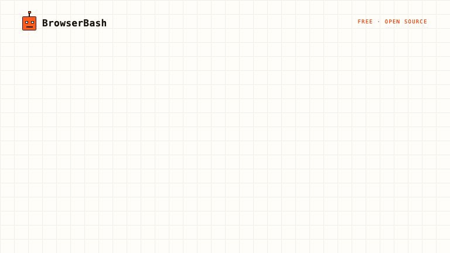

# BrowserBash

**Plain-English browser automation. No selectors. Free and open-source.**

[](https://www.npmjs.com/package/browserbash-cli)
[](https://www.npmjs.com/package/browserbash-cli)
[](https://github.com/PramodDutta/browserbash)
[](https://nodejs.org)



You write a plain-English objective. An AI agent drives a **real Chrome browser** step by step — no selectors, no scripts. Ollama-first, so it runs on free local models with **no API keys** and nothing ever leaves your machine.

```bash
npm install -g browserbash-cli
browserbash run "Open news.ycombinator.com and store the top story title as 'top_story'"
```

**[Website](https://browserbash.com)** · **[Docs / Learn](https://browserbash.com/learn)** · **[Tutorials](https://browserbash.com/tutorials)** · **[npm](https://www.npmjs.com/package/browserbash-cli)**

---

Both layers are swappable: the **engine** interprets the English, the **provider** runs the browser.

## Engines (who interprets the English)

| Engine | What it is | License |
|---|---|---|
| `stagehand` (default) | [Stagehand](https://www.stagehand.dev) — open-source AI browser automation framework by Browserbase. act/extract/observe/agent primitives, self-healing, supports Anthropic/OpenAI/Google models. | MIT |
| `builtin` | In-repo Anthropic tool-use loop driving Playwright. Used automatically for grids Stagehand can't attach to (LambdaTest, BrowserStack). | Apache-2.0 |

## Providers (where the browser runs)

| Provider | Where the browser runs | Engine | Auth |
|---|---|---|---|
| `local` (default) | Chromium/Chrome on this machine | stagehand or builtin | none |
| `cdp` | Any Chrome DevTools Protocol endpoint (your grid, docker, Playwright MCP-managed browser) | stagehand or builtin | none |
| `browserbase` | Browserbase cloud browsers | stagehand only | `BROWSERBASE_API_KEY` / `BROWSERBASE_PROJECT_ID` |
| `lambdatest` | LambdaTest / TestMu AI cloud grid | builtin (auto) | `LT_USERNAME` / `LT_ACCESS_KEY` |
| `browserstack` | BrowserStack Automate cloud grid | builtin (auto) | `BROWSERSTACK_USERNAME` / `BROWSERSTACK_ACCESS_KEY` |

## LLM backends (who does the thinking) — open source first

Default model is `auto`, resolved in this order:

1. **Ollama running locally** → `ollama/<OLLAMA_MODEL or first installed model>` — free, open source, no keys
2. `ANTHROPIC_API_KEY` set → `claude-opus-4-8`
3. `OPENAI_API_KEY` set → `openai/gpt-4.1`
4. otherwise: error with setup guidance

| Backend | Model flag | Needs |
| --- | --- | --- |
| **Ollama — local, free, OSS (preferred)** | `auto` or `ollama/<model>` e.g. `ollama/qwen3` | Ollama running; `OLLAMA_BASE_URL` to override `http://localhost:11434/v1`, `OLLAMA_MODEL` to pin auto-detection. Same flag works for any OpenAI-compatible server (vLLM, LM Studio, llama.cpp). |
| Anthropic | `claude-opus-4-8` | `ANTHROPIC_API_KEY` |
| OpenAI / Google | `openai/gpt-4.1`, `google/gemini-2.5-flash` | provider key (Stagehand engine) |
| **OpenRouter — hundreds of models, one key** | `openrouter/<vendor>/<model>` e.g. `openrouter/anthropic/claude-sonnet-4-6`, `openrouter/meta-llama/llama-3.3-70b-instruct` | `OPENROUTER_API_KEY` (https://openrouter.ai/keys); override endpoint with `OPENROUTER_BASE_URL` |
| Anthropic-compatible gateway | `claude-*` + `ANTHROPIC_BASE_URL` | builtin engine routes through any Anthropic-compatible endpoint (e.g. a LiteLLM proxy fronting local models) |

### Fully free / open-source stack (the default)

```bash
ollama pull qwen3                 # or any tool-capable local model
browserbash run "Open https://example.com and store the heading as 'h1'"
```

Stagehand engine (MIT) + local Chromium + Ollama (MIT) — zero cloud cost, no API keys. Tip: small models (≤8B) are flaky on multi-step objectives; Qwen3 / Llama 3.3 70B class works best.

Note: cloud-grid providers (`lambdatest`, `browserstack`) use the builtin engine, which speaks the Anthropic API — pair them with `ANTHROPIC_API_KEY` or an `ANTHROPIC_BASE_URL` gateway.

## Install

```bash
npm install
npm run build
npm link        # exposes the `browserbash` command
```

Requires Node ≥ 18 and Google Chrome stable (for the `local` provider).

## Quick start

```bash
export ANTHROPIC_API_KEY=sk-ant-...

# One-shot objective, local browser, Stagehand engine (default)
browserbash run "Open https://news.ycombinator.com and store the top story title as 'top_story'"

# Browserbase cloud (Stagehand native)
export BROWSERBASE_API_KEY=... BROWSERBASE_PROJECT_ID=...
browserbash run "..." --provider browserbase

# Cloud grid (auto-switches to builtin engine)
export LT_USERNAME=... LT_ACCESS_KEY=...
browserbash run "..." --provider lambdatest --headless

# Attach to an existing browser (CDP / Playwright MCP)
browserbash run "..." --cdp-endpoint ws://localhost:9222/devtools/browser/<id>

# Force the builtin engine
browserbash run "..." --engine builtin
```

## Agent mode (for AI coding tools & CI)

`--agent` switches stdout to NDJSON — one JSON object per line, stable schema:

```bash
browserbash run "<objective>" --agent --headless --timeout 120
```

- Progress events: `{"type":"step","step":1,"status":"passed","action":"navigate","remark":"...","cached":false}`
- Terminal event: `{"type":"run_end","status":"passed|failed|error|timeout","summary":"...","final_state":{...},"duration_ms":...,"provider":"local","cache":"hit|miss|off","tokens_in":...,"tokens_out":...,"test_url":"..."}`

Exit codes: `0` passed · `1` failed · `2` error · `3` timeout. `cached`, `cache`, `tokens_in`/`tokens_out` are additive fields (present when relevant), so existing consumers are unaffected.

Full agent integration guide: [docs/agents.md](docs/agents.md).

## Dashboards

Every run is kept in a private on-disk store (`~/.browserbash/runs`, secrets masked, capped at 200). Two ways to see them:

**Local dashboard — free, no account, fully local:**

```bash
browserbash dashboard                 # serve http://localhost:4477 and open it
browserbash run "..." --record --dashboard   # run, then open the dashboard on this run
browserbash dashboard --clear         # wipe the local store
```

Left panel lists your runs; the main pane shows the verdict, extracted values and the recording — a screenshot **and a session video** with `--record` (video needs `ffmpeg`, bundled). Nothing leaves your machine.

**Cloud dashboard — optional, opt-in per run:** a hosted dashboard at [browserbash.com/dashboard](https://browserbash.com/dashboard) with run history across machines and shareable per-run pages.

```bash
browserbash connect --key bb_...      # one-time, key from browserbash.com/dashboard
browserbash run "..." --record --upload   # push THIS run (verdict + recording) to the cloud
```

Without `--upload` nothing is sent to the cloud. BrowserBash is free and open source; cloud runs are kept 15 days.

## Replay cache (warm runs skip the model)

A green run records the actions it took. The next identical run **replays them with zero model calls**, and the agent only steps back in when the page actually changed. Steady-state suites run at close to script speed and cost.

```bash
browserbash testmd run ./checkout_test.md            # run 1: records the journal
browserbash testmd run ./checkout_test.md            # run 2: replays, no model
browserbash testmd run ./checkout_test.md --no-cache      # ignore the cache for this run
browserbash testmd run ./checkout_test.md --refresh-cache # wipe this test's entry, re-record
```

`run_end.cache` reports `hit` / `miss` / `off`. On by default; `config set cache.enabled false` to disable, `cache.dir` to relocate (default `.browserbash/cache`, gitignored by `init`). Secrets never enter the cache: values arrive through the variables channel (Stagehand) or are re-templatized to `{{name}}` tokens (builtin), and any cached action that types a secret is origin-pinned — replaying it on a different origin fails closed.

## Parallel suites (`run-all`)

Run a whole folder of `*_test.md` files at once with memory-aware scheduling:

```bash
browserbash run-all .browserbash/tests --concurrency 8 --junit out/junit.xml
```

- Concurrency is auto-derived from CPU **and** free memory (`min(requested, cpus, floor((mem - 2GB) / budget))`), so big suites do not thrash the machine. Override with `--concurrency`, tune the estimate with `--memory-budget <mb>`.
- Each test runs as an isolated child process with its own `Result.md`; a failure never leaks state to the next test.
- `--retries <n>` retries infra errors only (not real failures), `--max-failures <n>` stops early, `--stagger <ms>` softens burst load.
- Outputs: a merged NDJSON stream (`--events`, add `--agent` to also stream on stdout), JUnit XML (`--junit`), and a `RunAll-Result.md` with a flaky column.
- Run history in `.browserbash/memory/history.json` orders the next run (previously-failed first, then slowest first) and flags flaky tests. `--no-memory` opts out.
- Exit code: `0` all passed · `1` any failed · `2` infra error · `3` suite timeout.

## Cheap-model routing

Plan on a strong model, execute on a cheap one, escalate back automatically after a failed step:

```bash
browserbash run "..." --model claude-opus-4-8 --model-exec claude-haiku-4-5
```

`run_end` reports `tokens_in` / `tokens_out` (builtin engine) so you can see what a run costs. Set persistently with `config set routing.executionModel <id>`.

## Test files (`*_test.md`)

Committable, reviewable Markdown tests:

```markdown
# Login flow

- Open {{base_url}}/login
- Type {{username}} into the email field
- Type {{password}} into the password field and press Enter
- Verify the dashboard heading is visible
- Store the logged-in user name as 'user_name'
```

```bash
browserbash testmd run ./.browserbash/tests/login_test.md --provider browserstack
```

Composition via `@import ./helpers/login.md` (steps are spliced in place). After every run a `Result.md` is written next to the test file.

## Variables

`{{key}}` placeholders are substituted in objectives and test steps. Load order (highest priority last):

1. Global: `~/.browserbash/variables/*.json`
2. Project: `./.browserbash/variables/*.json`
3. `--variables-file <path>`
4. `--variables '<json>'`

Mark sensitive values `{"value": "...", "secret": true}` — they are masked as `*****` in all logs and NDJSON output.

## Configuration

```bash
browserbash init                          # scaffold ./.browserbash/
browserbash config show
browserbash config set defaultProvider lambdatest
browserbash providers                     # list providers
browserbash login --provider lambdatest --username "$USER" --access-key "$KEY"
browserbash whoami
```

Precedence: **flags > env vars > ~/.browserbash/config.json defaults**.

## CI recipe (GitHub Actions)

```yaml
- run: npm ci && npm run build
- run: |
    node dist/index.js login --provider lambdatest --username "$LT_USERNAME" --access-key "$LT_ACCESS_KEY"
    node dist/index.js testmd run .browserbash/tests/smoke_test.md --agent --headless --timeout 180
  env:
    ANTHROPIC_API_KEY: ${{ secrets.ANTHROPIC_API_KEY }}
    LT_USERNAME: ${{ secrets.LT_USERNAME }}
    LT_ACCESS_KEY: ${{ secrets.LT_ACCESS_KEY }}
```

The process exit code is the test verdict — no output parsing needed.

## Architecture

```text
src/
├── index.ts            # CLI (commander): run, testmd, login, config, providers, init
├── runner.ts           # engine routing + provider session + vendor status reporting
├── engine/
│   ├── stagehand.ts    # default engine: Stagehand agent (stagehand.dev, MIT) — LOCAL / cdpUrl / Browserbase
│   ├── agent.ts        # builtin engine: Anthropic tool-use loop (manual loop → NDJSON step events)
│   └── tools.ts        # builtin browser tools: navigate, snapshot, click, type_text, wait_for, extract, done
├── providers/          # vendor abstraction — add a new vendor by implementing BrowserProvider
│   ├── types.ts        # BrowserProvider / ProviderSession interfaces
│   ├── local.ts        # system Chrome
│   ├── cdp.ts          # attach to any CDP endpoint (incl. Playwright MCP browsers)
│   ├── lambdatest.ts   # LambdaTest/TestMu grid + setTestStatus reporting
│   └── browserstack.ts # BrowserStack Automate grid + setSessionStatus reporting
│   ├── replay.ts       # builtin replay-first cache: replay recorded actions, origin-pinned
│   └── routing.ts      # per-model thinking config + cheap-exec model routing
├── orchestrator/       # run-all: memory-aware scheduler + child-process suite runner
│   ├── scheduler.ts    # concurrency formula, admission watermark, JUnit
│   └── run-all.ts      # spawn children, aggregate NDJSON, verdicts, retries
├── cache-store.ts      # builtin action-journal cache (re-templatized, origin-pinned)
├── memory-store.ts     # run history: ordering + flaky report
├── testmd/             # *_test.md parser (@import, ordered steps) + Result.md writer
├── config.ts           # ~/.browserbash/config.json + credential resolution
├── variables.ts        # {{var}} substitution, secrets masking
└── output.ts           # NDJSON / human reporter
```

Adding a vendor = one file implementing `BrowserProvider` (`connect()` returning a Playwright `Browser`/`Page`) + one registry line in `providers/index.ts`.

## License

Apache-2.0
